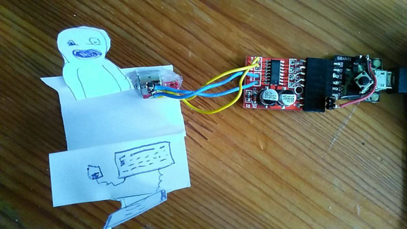
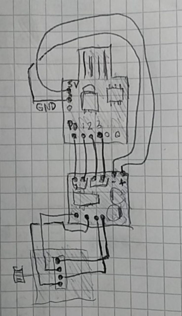

# Bang Head On Keyboard

My First and Best DIY project with mini stepper motor. A small stepper motor without gearing mechanism is quit ugly. You will never be sure that it come to the position, that you want.

## Hardware

- Adafruit Trinket or other ATtiny85 board, with programmer or [Bootloader](https://github.com/no-go/ATtiny85-Bootloader)
- some wire
- one 2-Phase 4-Wire Mini Stepper Motor 3-5V
- one 2-channel DC motor driving module or stepper motor driver module

## Design

## Circuit

## In Action

